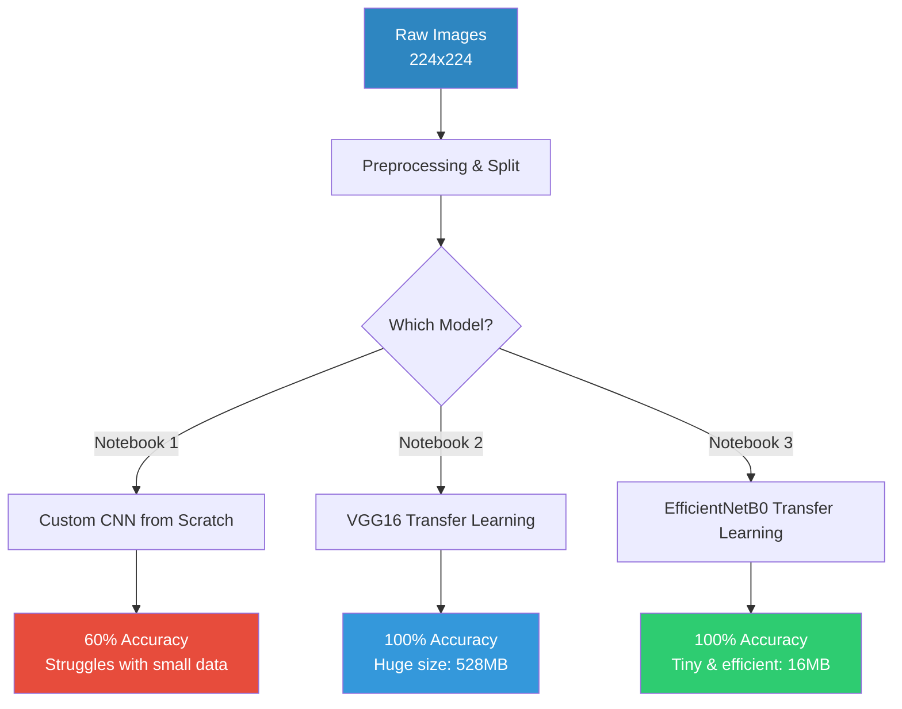

<p align="center">
  
</p>

<p align="center">
  
  
  
  
</p>

---

## My Goal & Journey

This is a personal learning project where I explored binary image classification (detecting whether a person is wearing a face mask or not). 

I started by building a custom network from scratch, got humbled by how poorly it performed on a tiny dataset, and then experimented with transfer learning using VGG16 and EfficientNetB0. 

Here is what I learned along the way, mapped out across three different notebooks.

---

## Project Structure

```
face_mask_detection/
├── notebooks/
│   ├── face_mask_detection1.ipynb   # 1. Custom CNN from Scratch
│   ├── face_mask_detection2.ipynb   # 2. VGG16 Transfer Learning
│   └── face_mask_detection3.ipynb   # 3. EfficientNetB0 Transfer Learning
├── reference/
│   └── original_colab_notebook.ipynb
├── README.md
├── requirements.txt
└── .gitignore
```

---

## The Three Approaches



---

## Comparison Table

After running all three notebooks in Google Colab, here are the actual training results:

| Metric | Notebook 1: Custom CNN | Notebook 2: VGG16 | Notebook 3: EfficientNetB0 |
| :--- | :--- | :--- | :--- |
| **Total Parameters** | ~431k | ~134.3 Million | ~4.1 Million |
| **Trainable Parameters** | ~431k | 4,097 | **1,281** |
| **Model Size on Disk** | ~1.7 MB | ~528 MB | **~16 MB** |
| **Test Accuracy** | **60%** | **100%** (Overfit?) | **100%** (Overfit?) |
| **Epochs to Converge** | ~8 (Stopped early) | ~5 | ~5 |

---

## What I Learned (My Takeaways)

### 1. Newborn Models Struggle to "See"
My custom CNN ([face_mask_detection1.ipynb](file:///Users/abhigoyal/Documents/Acadss/Data%20Science/Projects/face_mask_detection/notebooks/face_mask_detection1.ipynb)) struggled to hit 60% accuracy. 
* **The Reason:** Because it starts with completely random weights, it has to learn low-level visual concepts (edges, corners, facial contours) from scratch.
* **The Problem:** We only have ~960 training images. That's not nearly enough data to teach a network how to see. It ended up guessing the majority class or getting confused by background noise.

### 2. The Batch Normalization "Momentum" Trap
During my first scratch run, validation accuracy was completely flat at 51.9% (predicting all 0s) while training accuracy went up. 
* **The Culprit:** In Keras, `BatchNormalization` has a default momentum of `0.99` for moving statistics. Because my training runs were short and dataset was small, the moving average statistics never converged. 
* **The Fix:** Dropping momentum to `0.9` allowed the model to update statistics faster, letting the model make actual predictions on validation/test sets.

### 3. VGG16 is a Giant Overkill
Transfer learning with VGG16 ([face_mask_detection2.ipynb](file:///Users/abhigoyal/Documents/Acadss/Data%20Science/Projects/face_mask_detection/notebooks/face_mask_detection2.ipynb)) immediately shot up to ~100% accuracy.
* **Why it worked:** It borrows pre-trained ImageNet features, so it already knows how to find faces. We only had to train 4,097 parameters.
* **The Drawback:** The model is **528 MB**. Running this on a raspberry pi or a mobile webcam would be incredibly slow and memory-intensive.

### 4. EfficientNetB0 is the Sweet Spot
In Notebook 3 ([face_mask_detection3.ipynb](file:///Users/abhigoyal/Documents/Acadss/Data%20Science/Projects/face_mask_detection/notebooks/face_mask_detection3.ipynb)), I loaded `EfficientNetB0` with `include_top=False`. 
* **Why it's awesome:** It achieved 100% accuracy with only **1,281 trainable parameters** (the rest are frozen).
* **Efficiency:** The model size is only **16 MB** (33x smaller than VGG16). If I wanted to deploy this model to a live webcam detector, this is the one I would choose.

### 5. Is 100% Accuracy Real? (A Reality Check)
While getting a 100% classification report on Notebook 2 and 3 looks amazing, it's a bit of an illusion:
* **Synthetic Data:** The "with_mask" dataset was created by digitally pasting surgical mask overlays onto existing faces. The transfer learning models easily detected the sharp digital artifacts of the pasted masks.
* **Data Leakage:** Many base face images are shared between train and test sets. The model essentially memorized the background/person and checked for the synthetic mask shape.
* **Takeaway:** In a real-world setting with real-world face masks, this model's accuracy would drop. A more diverse, fully organic dataset is needed for real-world robustness.

---

## How to Run

1. Open any notebook in **Google Colab**.
2. Select **GPU** runtime (Runtime → Change runtime type → T4).
3. Run the cells sequentially — the dataset will be fetched automatically.
