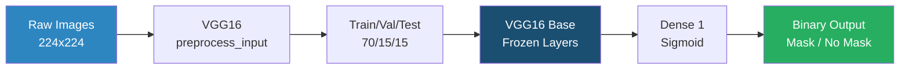

<p align="center">
  
</p>

<p align="center">
  
  
  
  
  
</p>

---

## About

A learning project that classifies face images as **with mask** or **without mask** using transfer learning. Built on Google Colab with a T4 GPU.

The model uses **VGG16** (pretrained on ImageNet) as a frozen feature extractor, with only a single dense layer trained on top — achieving **~96% test accuracy** on a dataset of ~1,376 images.

---

## Project Structure

```
face_mask_detection/
├── notebooks/
│   └── face_mask_detection.ipynb   # Clean, organized notebook
├── reference/
│   └── original_colab_notebook.ipynb  # Original messy Colab notebook
├── .gitignore
└── README.md
```

---

## Pipeline Overview



---

## How It Works

### 1. Dataset
- Source: [pyimagesearch-face-mask-detector](https://github.com/ricklon/pyimagesearch-face-mask-detector)
- Two classes: `with_mask` (690 images) and `without_mask` (686 images)
- All images resized to **224×224** pixels

### 2. Transfer Learning with VGG16
VGG16 is a 16-layer deep CNN trained on ImageNet (14M images, 1000 classes). Instead of training a CNN from scratch on our small dataset, we:

1. **Load VGG16** with pretrained ImageNet weights
2. **Remove** the final 1000-class softmax layer
3. **Freeze** all 134M parameters (no gradient updates)
4. **Add** a single `Dense(1, activation='sigmoid')` layer → only **4,097 trainable parameters**

> **Why this works:** The early layers of VGG16 detect edges, textures, and shapes — these features are universal and transfer well to new tasks. We only need to train the final layer to map these features to our binary classes.

### 3. Data Augmentation
To prevent overfitting on our small dataset, we apply real-time augmentation during training:
- Random rotation (±20°)
- Horizontal flip
- Zoom (±20%)
- Shear (±20%)

### 4. Training Details
| Parameter | Value |
|-----------|-------|
| Optimizer | Adam |
| Loss | Binary Crossentropy |
| Batch Size | 32 |
| Max Epochs | 30 |
| Early Stopping | patience=3 |
| Best Model Saved | `best_model.keras` |

### 5. Results
| Metric | without_mask | with_mask |
|--------|:-----------:|:---------:|
| Precision | ~0.96 | ~0.96 |
| Recall | ~0.95 | ~0.97 |
| F1-Score | ~0.96 | ~0.96 |
| **Overall Accuracy** | | **~96%** |

---

## Technical Decisions Explained

### Why VGG16 and Not a Custom CNN?
With only ~1,376 images, training a deep CNN from scratch would overfit badly. VGG16's pretrained features act as a powerful, general-purpose feature extractor — we get the benefit of training on 14M images without needing that data ourselves.

### Why Freeze All Layers?
Fine-tuning (unfreezing some layers) can improve results on larger datasets, but with <1,500 images, the risk of overfitting the pretrained features is high. Keeping all VGG16 layers frozen is the safer choice.

### Why Binary Crossentropy + Sigmoid (Not Softmax)?
For a two-class problem, a single sigmoid output is simpler and mathematically equivalent to a 2-unit softmax. It outputs a probability between 0 and 1 — threshold at 0.5 to classify.

### Why `preprocess_input` Instead of `/255`?
VGG16 was trained with a specific preprocessing: subtracting the ImageNet mean pixel values per channel (not simple 0-1 normalization). Using the same preprocessing at inference time is critical for the pretrained weights to produce meaningful features.

---

## How to Run

1. Open `notebooks/face_mask_detection.ipynb` in **Google Colab**
2. Set runtime to **GPU** (Runtime → Change runtime type → T4 GPU)
3. Run all cells sequentially

> **Note:** The notebook clones the dataset from GitHub — no manual download needed.

---

## What I Learned

- Transfer learning lets you build accurate classifiers even with very small datasets
- Freezing pretrained layers is a simple but effective strategy to avoid overfitting
- Data augmentation is essential when working with limited training images
- EarlyStopping + ModelCheckpoint together give you the best model without manual monitoring
- VGG16's `preprocess_input` is different from simple normalization — using the wrong preprocessing breaks everything

---

## Technologies Used

| Tool | Purpose |
|------|---------|
| TensorFlow/Keras | Deep learning framework |
| VGG16 | Pretrained feature extractor |
| OpenCV | Image loading and resizing |
| scikit-learn | Train/test split, classification report |
| Matplotlib | Training curve visualization |
| Google Colab | GPU runtime (T4) |
