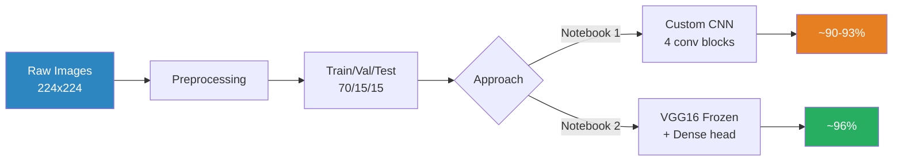

<p align="center">
  
</p>

<p align="center">
  
  
  
  
</p>

---

## What is this?

A learning project where I built two different approaches to classify face images as **mask** or **no mask**:

1. **Notebook 1** — Custom CNN from scratch (~90-93% accuracy)
2. **Notebook 2** — VGG16 transfer learning (~96% accuracy)

The goal was to understand *why* transfer learning works so much better on small datasets.

---

## Project Structure

```
face_mask_detection/
├── notebooks/
│   ├── face_mask_detection1.ipynb   # Custom CNN from scratch
│   └── face_mask_detection2.ipynb   # VGG16 transfer learning
├── reference/
│   └── original_colab_notebook.ipynb
├── README.md
├── requirements.txt
└── .gitignore
```

---

## Pipeline



---

## Notebook 1: Custom CNN from Scratch

Built a 4-block CNN: Conv2D → BatchNorm → MaxPool → Dropout, ending with GlobalAveragePooling.

**Key choices:**
- **Swish activation** in middle blocks (slightly better gradients than ReLU for deeper layers)
- **GlobalAveragePooling** instead of Flatten (way fewer params → less overfitting)
- **BatchNorm + Dropout** together to stabilize training
- **ReduceLROnPlateau** — drops learning rate by 5x when validation loss stalls
- Adam optimizer with low LR (1e-4)

**Result:** ~90-93% accuracy. Decent, but clearly limited by the small dataset.

## Notebook 2: VGG16 Transfer Learning

Loaded VGG16 (pretrained on 14M ImageNet images), froze all 134M params, added a single Dense(1, sigmoid) layer.

**Key choices:**
- **`preprocess_input`** instead of `/255` — VGG16 expects ImageNet-style preprocessing (channel mean subtraction), not simple normalization
- **Freeze everything** — with <1,500 images, fine-tuning risks destroying the pretrained features
- **Only 4,097 trainable params** — converges in ~5-7 epochs

**Result:** ~96% accuracy. Significantly better with way less training.

---

## What I Learned

### On CNNs
- Building from scratch teaches you how convolutions, pooling, and batch norm actually work together
- GlobalAveragePooling > Flatten for small datasets — it acts as a structural regularizer
- Swish is a nice upgrade from ReLU but won't save you if the data is too small

### On Transfer Learning
- Pretrained features from ImageNet generalize surprisingly well to faces/masks
- The preprocessing must match what the model was trained with — `/255` vs `preprocess_input` makes a huge difference
- Freezing all layers is the right move for tiny datasets

### On the Comparison
- Transfer learning gave ~3-6% better accuracy with 33,000x fewer trainable params
- The custom CNN needed heavier augmentation and LR scheduling just to reach 90%
- **Takeaway:** For small image datasets, always try transfer learning first

---

## How to Run

1. Open either notebook in **Google Colab**
2. Set runtime to **GPU** (Runtime → Change runtime type → T4)
3. Run all cells — the dataset is cloned from GitHub automatically

---

## Tech Stack

| Tool | Purpose |
|------|---------|
| TensorFlow/Keras | Model building and training |
| VGG16 | Pretrained feature extractor (notebook 2) |
| OpenCV | Image loading and resizing |
| scikit-learn | Train/test split, classification report |
| Matplotlib | Training curves |
| Google Colab | GPU runtime (T4) |
